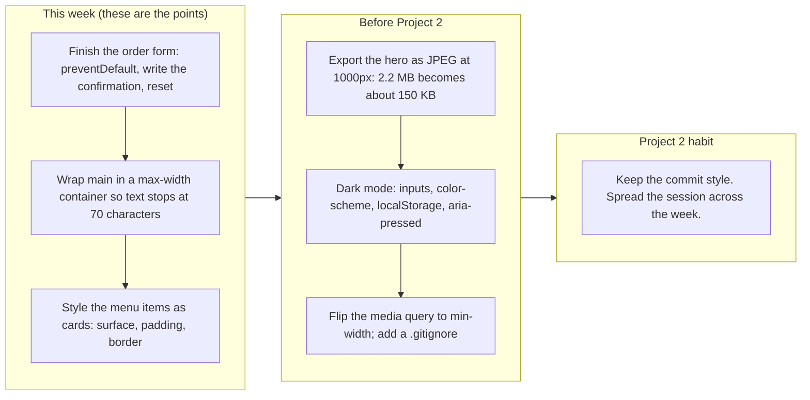

# Project 1: Static Foundations. Feedback for Elliot Radov

**Student:** Elliot Radov · **Course:** CSC 436, Fall 2026 · **Reviewed at commit:** [`a6fa8b1`](https://github.com/FantasyGodX/436_Proj1/commit/a6fa8b176819906a46d02e2d8b96633a59680da4)
**Repo:** https://github.com/FantasyGodX/436_Proj1 · **Live:** https://mango-moon.netlify.app/

> **How this review was made.** Your instructor reviewed this project with Claude (Anthropic's AI) as a second set of eyes. Claude cloned the repo, read every line of the HTML and CSS, loaded the live site at phone, tablet and desktop widths, ran the W3C validator, clicked the dark mode toggle and reloaded to see if it stuck, filled in the order form and submitted it, measured the image, diffed the live site against the repo, and read all twenty-four commits. Every note and every point below was read and approved by your instructor. Same rubric, same standard, just more time spent looking at your code than one person has in a grading week.

## Grade: 79 / 100

| Category | Points | Earned | One line |
|---|---|---|---|
| Semantic HTML | 20 | **18** | Every element the brief lists, one h1, a label on every field, zero validator errors; hero text wrapped in an article, toggle has no pressed state |
| CSS layout | 25 | **18** | Flexbox header, nav and form, auto-fit Grid menu, all yours and all working; no container so desktop text runs 1240 px wide, menu items are unstyled, dark mode stops at the inputs |
| Responsive design | 15 | **12** | No horizontal scroll anywhere, header stacks, grid steps 1 to 2 to 3; one desktop-first query, hero never uses the width it has |
| JavaScript interaction | 15 | **11** | Dark mode toggle works and relabels itself; the order form submits to nowhere and wipes itself, the choice is lost on reload |
| Repository and deployment | 15 | **14** | Best commit history in the class, README has everything, deploy matches repo; editor settings committed, no .gitignore |
| Content and polish | 10 | **6** | Coherent little restaurant with consistent copy and color; a 2.2 MB hero image that repeats the menu and disagrees with it, plain menu, 2024 footer |
| **Total** | **100** | **79** | Disciplined and correct, and much smaller than it needed to be. Finish the form and give it a design. |

## The short version

Everything you built works and validates. Header, nav with a list, main with three sections, articles for the menu items, a figure, a form with a label on every field, a footer, one h1. Flexbox does the header, the nav and the form; an auto-fit Grid does the menu and steps from one column to three without a single media query. The dark mode toggle flips the page and relabels itself. The commit history is the best in the class: twenty-four commits that read like a build log, "Add header with brand and navigation structure," "Add CSS grid layout for menu items," "Add responsive media queries for mobile layout." Anyone could follow how this site was made.

The grade is in the seventies rather than the eighties because the site stops at the skeleton. The whole thing is 123 lines of HTML and 138 of CSS. On a desktop the text runs edge to edge across 1240 pixels because nothing sets a max-width. The menu items are three headings in a grid with no card around them. The order form, which is the page's reason to exist, has a `#form-message` paragraph waiting for a confirmation that no script ever writes, so submitting it reloads the page and empties every field. Dark mode leaves the inputs white. And the hero image is a 2.2 MB PNG of the same three bowls the menu lists underneath it, with names and prices baked into the pixels, one of which does not match the text.

None of this is hard to fix. The roadmap at the bottom is three evenings.

## What the numbers looked like

| Check | Result |
|---|---|
| Horizontal scroll at 375 / 768 / 1280 px | None at any width |
| W3C HTML validator | 0 errors, 0 warnings, 8 info notes (trailing slashes, hero section has no heading of its own) |
| Heading order | h1 > h2 > h3, no skipped levels |
| Semantic elements | header, nav (ul of 3), main, 3 section, 4 article, figure, form with a label per field, footer |
| Media queries | 1, `max-width: 600px` (desktop-first) |
| Menu grid columns at 375 / 768 / 1280 | 1 / 2 / 3 via `auto-fit` |
| Header at 375 | Stacks to a column |
| Dark mode toggle | Body class flips, button text swaps; inputs stay white; nothing saved, back to light on reload |
| Order form, valid values, Submit | Page reloads with a GET; all fields cleared; `#form-message` never written |
| Console errors | 0 |
| CSS | 138 lines, 3 Flexbox containers, 1 Grid, 0 custom properties, 0 focus styles, 0 !important |
| Image | rice_img.png is 1536 by 1024, 2.2 MB PNG, shown at 500 px; 99 percent of the page weight |
| Commits | 24; 22 on Sep 12 between 19:58 and 22:23, 2 on Sep 15; every message says what changed |
| README | Title, description, run instructions, live URL, features, tech: all there |
| Live vs repo | Identical apart from the badge script Netlify injects |
| Housekeeping | No .gitignore; `.vscode/settings.json` committed |

---

## Semantic HTML: 18 / 20

### What's working

- The outline is exactly what the brief asks for. `<header>` with the brand and a `<nav>` holding a `<ul>` of anchors ([index.html#L12-L27](https://github.com/FantasyGodX/436_Proj1/blob/a6fa8b176819906a46d02e2d8b96633a59680da4/index.html#L12-L27)), `<main>` with three `<section>`s each with its own `h2`, an `<article>` per menu item with an `h3`, a `<figure>` for the hero image, and a `<footer>`. One `h1`. The validator finds zero errors.
- The form is done right: a `<label for>` on every control, `type="email"` and `type="time"` so the browser validates and gives the right keyboard, `required` on every field, a `<select>` with a real placeholder option ([index.html#L78-L99](https://github.com/FantasyGodX/436_Proj1/blob/a6fa8b176819906a46d02e2d8b96633a59680da4/index.html#L78-L99)). Most of the class did not get this far with a form.
- The `<button>` for the toggle is a real button, not a div. That matters for keyboard users.

### What to change

- **The hero text is not an article** ([index.html#L33-L40](https://github.com/FantasyGodX/436_Proj1/blob/a6fa8b176819906a46d02e2d8b96633a59680da4/index.html#L33-L40)). An `<article>` is content that would make sense on its own somewhere else, like a menu item or a blog post. A headline and a welcome sentence are not that. Make it a `<div class="hero-content">` and the hero `<section>` gets its `h2` back as a direct child, which also clears the validator's "section lacks heading" note.
- **The toggle button announces nothing** ([index.html#L26](https://github.com/FantasyGodX/436_Proj1/blob/a6fa8b176819906a46d02e2d8b96633a59680da4/index.html#L26)). Add `aria-pressed="false"` and flip it in the click handler. A screen reader then says "Dark mode, toggle button, not pressed."
- Small: the trailing slashes on `<meta />`, `<link />`, `` and `<input />` are harmless in HTML5 but the validator flags them eight times. Drop them.

## CSS layout: 18 / 25

### What's working

- **Flexbox and Grid, both authored, both doing real work.** The header is a three-part flex row with `space-between` ([style.css#L45-L50](https://github.com/FantasyGodX/436_Proj1/blob/a6fa8b176819906a46d02e2d8b96633a59680da4/style.css#L45-L50)), the nav list is flex with `gap`, and the form is a flex column with `gap` so labels and inputs space themselves ([style.css#L84-L90](https://github.com/FantasyGodX/436_Proj1/blob/a6fa8b176819906a46d02e2d8b96633a59680da4/style.css#L84-L90)). The menu grid is `repeat(auto-fit, minmax(250px, 1fr))` ([style.css#L77-L81](https://github.com/FantasyGodX/436_Proj1/blob/a6fa8b176819906a46d02e2d8b96633a59680da4/style.css#L77-L81)), which is the one line of Grid that most people take a semester to learn. It gives you 1, 2 and 3 columns with no media query at all.
- A real reset, `box-sizing: border-box`, `line-height: 1.6`, `max-width` on the image with `height: auto`. The basics are all in place.

### What to change

- **Nothing has a max-width except the form and the image** ([style.css#L8-L14](https://github.com/FantasyGodX/436_Proj1/blob/a6fa8b176819906a46d02e2d8b96633a59680da4/style.css#L8-L14)). On a 1280 px screen the hero paragraph is one line 1240 px long, about 180 characters. Readable text is 60 to 75 characters. Give `main` (or each section) `max-width: 1100px; margin: 0 auto;` and the hero text `max-width: 60ch`. One rule, and the desktop stops looking like a text file.
- **The menu items are not cards** ([style.css#L77-L81](https://github.com/FantasyGodX/436_Proj1/blob/a6fa8b176819906a46d02e2d8b96633a59680da4/style.css#L77-L81)). The grid is there, but each `.menu-item` has no background, no padding, no border, no styled price. The result is three columns of plain text, and on desktop the section looks emptier than the hero image above it. Give `.menu-item` a surface (`background: #fff; padding: 20px; border-radius: 10px; box-shadow`), make `.price` bold and mango-colored, and the same grid becomes a menu.
- **Dark mode stops at the inputs** ([style.css#L116-L138](https://github.com/FantasyGodX/436_Proj1/blob/a6fa8b176819906a46d02e2d8b96633a59680da4/style.css#L116-L138)). Body, header, sections, footer, buttons and nav links all flip. The text inputs and the select stay white with black text, and the time picker popup stays light. Add `.dark-mode input, .dark-mode select { background: #333; color: #eee; border-color: #555; }` and `.dark-mode { color-scheme: dark; }` so the browser's own widgets follow.

  ```mermaid
  flowchart LR
    subgraph on["What .dark-mode restyles (style.css lines 116 to 138)"]
      direction TB
      a1["body background and text color"] ~~~ a2["header, section and footer background"]
      a2 ~~~ a3["primary buttons and their hover"]
      a3 ~~~ a4["nav link color"]
    end
    subgraph off["What stays in light mode"]
      direction TB
      b1["input and select: white boxes, black text"] ~~~ b2["the time picker and the select dropdown (no color-scheme: dark)"]
      b2 ~~~ b3["menu items: no card surface in either mode"]
      b3 ~~~ b4["the choice itself: lost on every reload (no localStorage)"]
    end
    on --> off
  ```

- **Nav links have padding and a radius but no hover or focus** ([style.css#L58-L64](https://github.com/FantasyGodX/436_Proj1/blob/a6fa8b176819906a46d02e2d8b96633a59680da4/style.css#L58-L64)). The rounded padding box is clearly waiting for a `:hover` background that never got written. Add `.site-nav a:hover, .site-nav a:focus-visible { background: #f7b731; }` and the nav feels finished. There is no `:focus` style anywhere in the file, so keyboard users cannot see where they are.
- Small: the mango gold `#f7b731` and the dark-mode gold `#c68d11` are typed by hand. Put them in `:root` as `--accent` and `--accent-dark` and the dark mode block gets shorter.

## Responsive design: 12 / 15

### What's working

- No horizontal scroll at 375, 768 or 1280. The header stacks to a column under 600 px, the grid goes 1 to 2 to 3 on its own, the form is capped at 400 px and centered, the image scales with `max-width: 100%`. Claude also verified all of this in a real 375 px viewport, not a shrunken desktop window.

### What to change

- **One query, and it is `max-width`** ([style.css#L100-L113](https://github.com/FantasyGodX/436_Proj1/blob/a6fa8b176819906a46d02e2d8b96633a59680da4/style.css#L100-L113)). The brief asked for mobile-first. Your base styles are the desktop (header in a row) and the query undoes them for phones. Flip it: make `.site-header { flex-direction: column }` the default and add the row inside `@media (min-width: 600px)`. Same result, right direction, and the CSS gets simpler as screens get bigger instead of more complicated as they get smaller.
- **The hero never uses the width it has.** `.hero` is `display: block` at every size, so on a tablet or desktop the headline, the paragraph and then the image stack in the middle of the screen with empty space either side. Make `.hero` a flex row at 768 px and up (`align-items: center; gap: 40px`) with the text on the left and the image on the right. That is the one layout change that would make the desktop look designed.

## JavaScript interaction: 11 / 15

### What's working

- **The toggle works and is written cleanly** ([index.html#L110-L119](https://github.com/FantasyGodX/436_Proj1/blob/a6fa8b176819906a46d02e2d8b96633a59680da4/index.html#L110-L119)). `classList.toggle` on the body, then `classList.contains` to pick the label. Ten lines, no state variable to get out of sync, and the CSS does the rest. Claude clicked it, the background went from `#fafafa` to `#1e1e1e`, and the button read "Light Mode." Zero console errors.

### What to change

- **The order form goes nowhere** ([index.html#L78-L99](https://github.com/FantasyGodX/436_Proj1/blob/a6fa8b176819906a46d02e2d8b96633a59680da4/index.html#L78-L99)). You gave the form an id, gave every field an id, and put an empty `<p id="form-message">` at the bottom. Then no script touches any of it. Claude filled in a name, an email, a bowl and a time and clicked Submit Order. The browser did a GET to the same URL, the page reloaded, and every field was empty. A customer would assume the site is broken. This is the biggest single fix on the page and it is about ten lines:

  ```js
  const form = document.getElementById("order-form");
  const message = document.getElementById("form-message");
  form.addEventListener("submit", (event) => {
    event.preventDefault();
    const bowl = document.getElementById("bowl-choice");
    const name = document.getElementById("customer-name").value;
    const time = document.getElementById("pickup-time").value;
    message.textContent = `Thanks, ${name}. Your ${bowl.options[bowl.selectedIndex].text} will be ready at ${time}.`;
    form.reset();
  });
  ```

  ```mermaid
  flowchart TB
    A["Customer fills in Name, Email, Bowl and Pickup Time"] --> B["Clicks Submit Order"]
    B --> C{"Is any JavaScript listening for submit?"}
    C -- "Today: no" --> D["Browser sends a GET to the same URL"]
    D --> E["Page reloads. Every field is empty. #35;form-message on line 98 stays blank."]
    C -- "After the fix" --> F["event.preventDefault()"]
    F --> G["Read the bowl and the pickup time from the fields"]
    G --> H["Write a confirmation into #35;form-message and reset the form"]
  ```

- **The theme is forgotten on reload.** Save it: `localStorage.setItem("theme", isDark ? "dark" : "light")` in the handler, and on load read it back and add the class before the first paint. Three lines. Bonus: `window.matchMedia("(prefers-color-scheme: dark)").matches` as the default when nothing is saved.
- Small: put the script in `script.js` and load it with `defer`. Inline is fine for ten lines, but the brief's next project will not fit in a `<script>` tag.

## Repository and deployment: 14 / 15

### What's working

- **This is the commit history the brief describes.** Twenty-four commits, each one a step: README, then header, then body structure, then hero, then form, then footer, then the stylesheet, then base styles, then flex, then grid, then media queries, then dark mode, then polish, then a deploy fix. Every message is a sentence in your own words, including "Fixed indentation (red boxes were annoying me)." Two follow-ups on Sep 15 after class feedback. Nobody else in the class has a history this readable. It was all one evening (Sep 12, 19:58 to 22:23), and that is fine, because the work is genuinely broken into steps.
- README has everything: title, description, live URL, features, tech, how to run, author ([README.md](https://github.com/FantasyGodX/436_Proj1/blob/a6fa8b176819906a46d02e2d8b96633a59680da4/README.md)). The live site is public and matches the repo byte for byte apart from the script Netlify injects.

### What to change

- **No `.gitignore`, and `.vscode/settings.json` is committed** ([.vscode/settings.json](https://github.com/FantasyGodX/436_Proj1/blob/a6fa8b176819906a46d02e2d8b96633a59680da4/.vscode/settings.json)). That file is your Live Server port, which is about your machine, not the project. Add a `.gitignore` with `.vscode/`, `.DS_Store` and `.env`, then `git rm --cached .vscode/settings.json`.
- Small: the live URL in the README is plain text. Make it a link so it is clickable on GitHub.

## Content and polish: 6 / 10

### What's working

- The idea is coherent and the copy is consistent: one dish, three bowls, real prices, a pickup form, "made fresh daily in Staten Island." The mango gold on off-white is a palette, and the emoji logo is a nice touch for a one-evening build. Nothing is lorem ipsum.

### What to change

- **The hero image is 2.2 MB** ([index.html#L43](https://github.com/FantasyGodX/436_Proj1/blob/a6fa8b176819906a46d02e2d8b96633a59680da4/index.html#L43)). It is a 1536 by 1024 PNG shown at 500 px, and it is 99 percent of everything the page downloads. The HTML and CSS together are under 6 KB. Export it as a JPEG at 1000 px wide and it drops to about 150 KB.
- **The page says the menu twice, and the two versions disagree.** The hero picture has "Sunrise Classic, $8.50," "Double Mango, $9.50" and "Golden Bowl, $10.00" baked into the pixels, with their descriptions. The menu section under it lists the same three bowls in text. The image says Double Mango has "roasted coconut flakes"; the HTML says "coconut flakes." A screen reader gets one version, a sighted user gets both. Either crop the image to a single bowl with no text (a hero image should be a photo, not a menu board), or put the three bowl images inside the three menu articles where they belong and let the HTML carry the words.
- **The menu section looks unfinished next to the image above it.** Three bold names, three sentences, three prices in plain body text. See the card note under CSS; this is the same fix.
- Small: `© 2024` ([index.html#L105](https://github.com/FantasyGodX/436_Proj1/blob/a6fa8b176819906a46d02e2d8b96633a59680da4/index.html#L105)). It is 2026. One line of JS (`new Date().getFullYear()`) or just type the right year.

---

## Your next three moves



1. **Finish the form.** Ten lines of JS and the page's main feature works. This is the single largest gap on the site.
2. **Give the desktop a shape.** A max-width on `main`, cards on the menu items, and a two-column hero at 768 px and up. Three rules, and it goes from a skeleton to a site.
3. **Shrink the image and fix the two-menus problem.** JPEG at 1000 px, and either a text-free hero photo or the bowl photos inside the menu cards.

*This review lives in a pull request on your repo. It only adds files under `feedback/` and does not touch your code. Merge it, close it, or just read it. Questions go to office hours or the Brightspace board. Your process is already right, Elliot. The next step is to keep going past the skeleton.*
